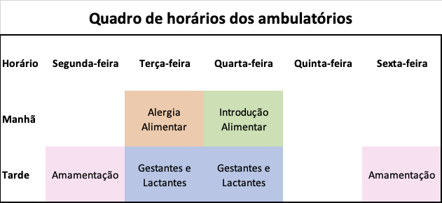
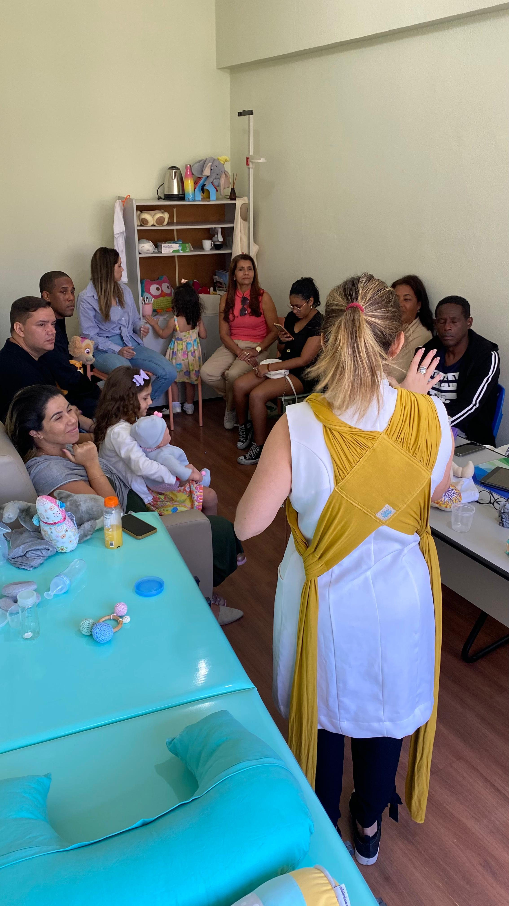
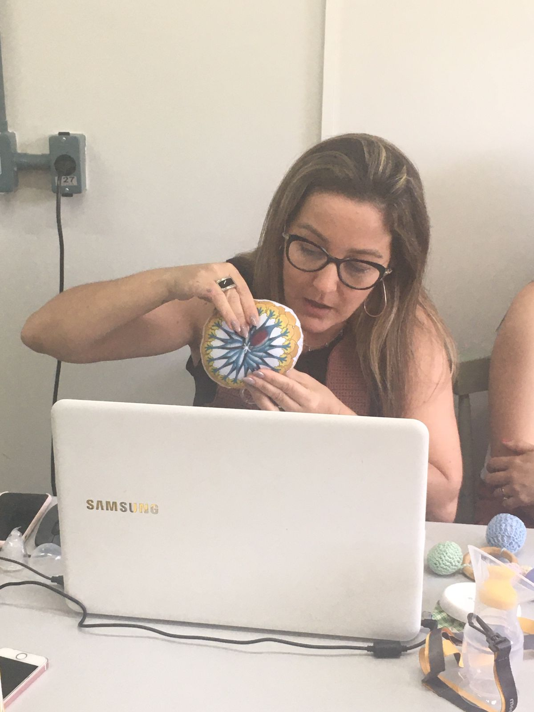
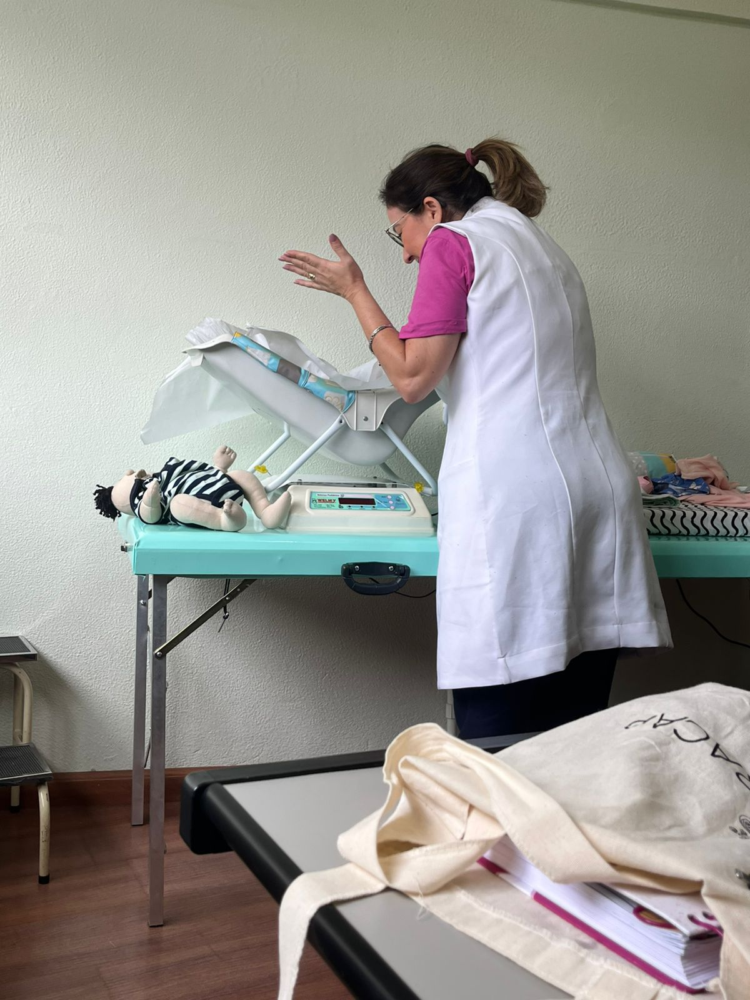
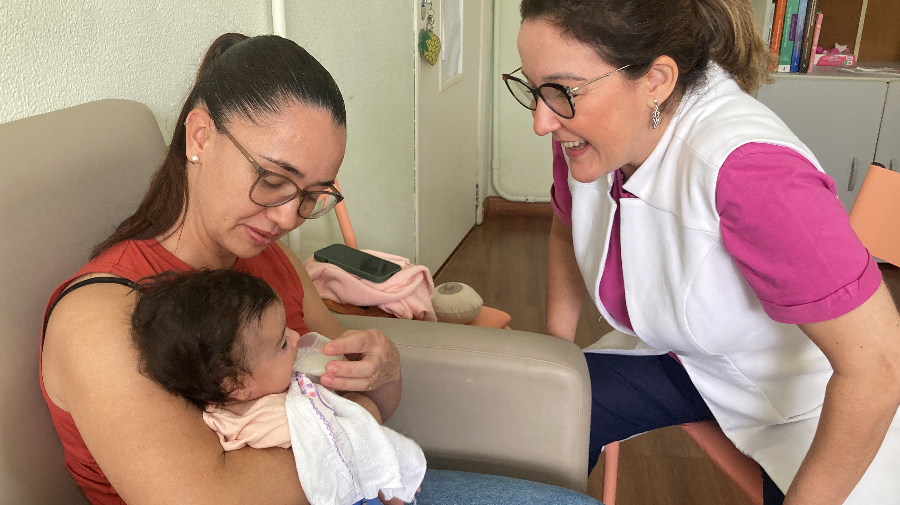

```{r, echo = FALSE}
htmltools::img(src = knitr::image_uri(file.path("imagens/anima.png")), 
               alt = 'anima', 
               style = 'position:absolute; top:50px; right:0px; padding:10px; width:150px;')
```

<br>

## **Ambulatórios** {.tabset .tabset-pills}

<br>

Os atendimentos ambulatoriais ocorrem, em sua maioria, de forma presencial no prédio da Faculdade de Nutrição.

As consultas são marcadas pelas próprias pacientes através do link disponível nas abas dos ambulatórios abaixo.

Oferecemos **consulta gratuita** em quatro ambulatórios: 

<br>

1) Atendimento nutricional para gestantes e lactantes;
2) Consultoria em amamentação;
3) Atendimento nutricional na Introdução Alimentar a partir de 6 meses;
4) Atendimento nutricional para criança até 2 anos com Alergias Alimentares.

<br>

<center>


</center>

<br>

**Para conhecer os nossos ambulatórios e marcar a sua consulta, acesse as abas abaixo:**

<br>

### **Consultoria em Amamentação**

<br>

<center>

**Nutricionista responsável**


**Professora Daniele Mendonça Ferreira**

MSc, DSc

<br>

<button type="button" class="btn btn-primary">[Marque sua consulta](https://minhaagendavirtual.com.br/agendamentos/incluir/animauff/25326475A)</button>

</center>

<br>

Este ambulatório envolve profissionais de saúde (nutricionistas e enfermeiras) especializados que oferecem orientações baseadas em evidências científicas, visando preparar e assistir as mulheres na amamentação. As consultas são baseadas na técnica do aconselhamento, que são essenciais no apoio à amamentação, incluindo:

**Escuta Ativa**: Atenção às necessidades e preocupações da mãe, permitindo uma compreensão aprofundada de suas experiências.

**Comunicação Efetiva**: Uso de linguagem clara e empática, estabelecendo uma relação de confiança com a mãe.

**Educação em Saúde**: Fornecimento de informações baseadas em evidências, capacitando a mãe para tomar decisões informadas.

**Empoderamento**: Incentivo à autonomia da mãe, valorizando suas escolhas e promovendo sua confiança no processo de amamentação.

<br>

O aleitamento materno é amplamente reconhecido por seus benefícios à saúde do bebê e da mãe. Entretanto, muitas mulheres enfrentam desafios que podem comprometer a continuidade da amamentação. A consultoria em amamentação surge como uma intervenção eficaz para superar essas dificuldades, proporcionando suporte personalizado e informações adequadas. Estudos demonstram que a atuação de consultores de lactação está associada ao aumento das taxas e da duração do aleitamento materno.

<br>

**Consultoria durante a gestação**

<br>

Durante a gestação, a consultoria em amamentação foca na preparação da gestante para o processo de amamentar. As ações desenvolvidas durante a consultoria em amamentação incluem:

**Educação Pré-Natal**: Fornecimento de informações sobre os benefícios do aleitamento materno, técnicas de amamentação e manejo de possíveis dificuldades.

**Planejamento Individualizado**: Avaliação das expectativas e preocupações da gestante, permitindo a elaboração de estratégias personalizadas para o sucesso da amamentação.

**Fortalecimento do Vínculo**: Promoção do vínculo mãe-bebê, destacando a importância do contato precoce e contínuo após o nascimento.

Essas ações visam capacitar a gestante, aumentando sua confiança e reduzindo a ansiedade relacionada à amamentação. A preparação adequada durante o pré-natal é essencial para estabelecer uma base sólida para o aleitamento materno. 

<br>

<center>



<br>



<br>

</center>

**Consultoria durante a lactação**

<br>

No período pós-parto, a consultoria em amamentação é focada nos objetivos da família em relação à alimentação do bebê e concentra-se em:

**Avaliação da mãe**: escuta ativa das queixas e dificuldades enfrentadas pela família, assim como a identificação dos fatores que possam influenciar na amamentação, incluindo o histórico ginecológico e obstétrico (número de gestações e partos, tipo de parto, complicações), experiências anteriores com a amamentação e informações recebidas durante o pré-natal, condições de saúde materna (diabetes, hipertensão, anemia, entre outras), uso de medicamentos e suplementos, características das mamas e do complexo mamilo-areolar (tipo de mamilo, presença de fissuras, ingurgitamento, mastite, síndrome de Raynaud), histórico de cirurgias mamárias, fatores emocionais e sociais. 

**Avaliação do bebê**: levantamento de informações sobre as condições de nascimento (idade gestacional ao nascer, peso, Apgar, presença de icterícia ou outras condições neonatais), avaliação dos reflexos (de busca, sucção, deglutição) e anatomia da boca do bebê (anquiloglossia, fenda palatina e labial, retrognatismo), avaliação da saúde geral, das excreções (xixi e cocô) e do ganho de peso.

**Avaliação da amamentação**: observação da técnica de pega e sucção do bebê, eficácia da amamentação, sustentação da mamada e sinais de saciedade.

**Avaliação da Rede de Apoio**: Presença de familiares ou amigos que apoiam a mãe na amamentação.

**Assistência Técnica**: Orientação sobre a posição e a pega corretas do bebê, prevenindo e solucionando problemas como fissuras mamilares e ingurgitamento mamário; técnicas de manejo da baixa produção de leite e da hiperlactação; técnicas de manejo das diversas condições do espectro da mastite; orientações sobre a extração manual de leite e o uso de bombas de extração e armazenamento do leite materno; orientações sobre o uso de fórmulas infantis como alimento complementar ao leite materno; orientações sobre a exterogestação e desenvolvimento do bebê; orientações sobre o sono do bebê; orientações sobre como manter a amamentação no retorno da mãe ao trabalho/estudos; orientações sobre o desmame gentil e gradual.
Como técnicas complementares ao manejo da amamentação, trabalhamos com a laserterapia para acelerar a regeneração tecidual e alívio da dor, e bandagem elástica para ajudar na drenagem linfática das mamas em casos de ingurgitamento.

**Monitoramento do Desenvolvimento**: Acompanhamento do ganho de peso do bebê e avaliação da eficácia da amamentação.

**Suporte Emocional**: Apoio à mãe em questões emocionais, reforçando sua autoestima e motivação para continuar amamentando; apoio no processo de desmame.

<br>

*Observação*: Não fornecemos diagnóstico clínico e nem prescrevemos medicamentos por ser competência exclusiva do profissional médico. Avaliamos as condições que influenciam na amamentação, realizamos e orientamos o manejo dessas condições no âmbito do escopo de atuação dos consultores de amamentação, fazemos os registros da avaliação e encaminhamos para o profissional competente (médico, fonoaudiólogo, dentista, fisioterapeuta, psicólogo, entre outros) para um cuidado integral e multiprofissional.

<br>

<center>



<br>



<br>


<br>

<button type="button" class="btn btn-primary">[Marque sua consulta](https://minhaagendavirtual.com.br/agendamentos/incluir/animauff/25326475A)</button>
</center>

### **Nutrição para Gestantes e Lactantes**

<br>

<center>

**Nutricionista responsável**


**Professora Ana Beatriz Franco Sena Siqueira**

MSc, DSc

<br>

<button type="button" class="btn btn-primary">[Marque sua consulta](https://minhaagendavirtual.com.br/agendamentos/incluir/animauff/33006475A)</button>

</center>

<br>

Neste ambulatório as consultas são cuidadosamente estruturadas para atender às necessidades específicas da mulher. Trabalhamos com a técnica do aconselhamento nutricional, que envolve não apenas a transmissão de informações, mas também a escuta ativa, compreensão das particularidades individuais e suporte contínuo.

<br>

A dinâmica da consulta ocorre da seguinte forma:

<br>

**1. Avaliação Inicial e Anamnese**

<br>

Essa avaliação permite personalizar as orientações e identificar áreas que necessitam de intervenção. São considerados os seguintes aspectos:

**Histórico Alimentar**: identificação dos padrões alimentares, preferências, aversões e possíveis deficiências nutricionais.

**Histórico Clínico e Obstétrico**: consideração das condições de saúde preexistentes, uso de medicamentos e suplementação.

**Estilo de Vida**: avaliação do nível de atividade física, hábitos de sono e fatores estressores.

<br>

**2. Avaliação nutricional:**

<br>

**Peso e Altura**: cálculo do Índice de Massa Corporal (IMC) e acompanahmento do ganho de peso durante a gestação.
**Exames Bioquímicos**: avaliação dos níveis de vitaminas, minerais e outros nutrientes essenciais; avaliação da glicemia e perfil lipídico, entre outros exames relacionados com o risco gestacional.

<br>

**3. Plano Alimentar Personalizado:**

<br>

Com base na avaliação inicial, o profissional irá calcular as necessidades energéticas e nutricionais adaptadas às necessidades da gestante ou lactante, baseando-se na programação de ganho de peso gestacional adequado ou perda de peso adequada durante a lactação, seguindo as orientações do Guia Alimentar para a População Brasileira e dos 10 passos para uma alimentação saudável na gestação e lactação. O plano alimentar irá considerar as preferências alimentares, restrições e possíveis intolerâncias. Além disso, as gestantes e lactantes recebem orientações sobre práticas seguras de manipulação e preparo dos alimentos para prevenir infecções alimentares. 

<br> 

O acompanhamento é realizado mensalmente, com o objetivo de monitorar o ganho de peso, a evolução do estado nutricional e a adesão ao plano alimentar. Durante as consultas, são abordados temas como a importância da hidratação, do sono, dos bons hábitos intestinais, a prática de atividade física adequada, e a suplementação de micronutrientes. As queixas comuns na gestação como náuseas e vômitos, azia, constipação intestinal, assim como as co-morbidades (diabetes, hipertensão, pré-eclâmpsia, hipotireoidismo, hipertireoidismo, anemia, etc.) são manejadas a partir de protocolos específicos baseados em evidências científicas atualizadas.

<br>

Todos os materiais educativos que reforçam as orientações fornecidas durante a consulta, assim como o plano alimentar individualizado são encaminhados por meio do aplicativo WebDiet® em até uma semana após a data da consulta.

<br>

Nas consultas de acompanhamento, verificamos se as orientações estão sendo seguidas e identificamos as barreiras; realizamos modificações conforme necessário, considerando mudanças no estado de saúde ou preferências alimentares; e fornecemos suporte contínuo a fim de manter a motivação e oferecer encorajamento para a adoção de hábitos saudáveis.

<br>

<center>
<button type="button" class="btn btn-primary">[Marque sua consulta](https://minhaagendavirtual.com.br/agendamentos/incluir/animauff/33006475A)</button>
</center>


### **Introdução Alimentar**

<br>

<center>

**Nutricionista responsável**


**Professora Enilce de Oliveira Fonseca Sally**

MSc, DSc

<br>

<button type="button" class="btn btn-primary">[Marque sua consulta](https://minhaagendavirtual.com.br/agendamentos/incluir/animauff/23173475A)</button>

</center>

<br>

A introdução alimentar é uma etapa crucial no desenvolvimento infantil, marcada pela transição do aleitamento para a inclusão de novos alimentos na dieta da criança. Uma consulta nutricional adequada nesse período deve ser cuidadosamente planejada, utilizando ferramentas de aconselhamento em saúde que garantam uma orientação eficaz e personalizada.

<br>

As consultas no ambulatório de Introdução Alimentar ocorrem da seguinte forma:

<br>

**1. Avaliação Inicial e Anamnese**

O primeiro passo na consulta nutricional é realizado com uma anamnese detalhada, que abrange:

**Histórico de saúde do bebê**: incluindo informações sobre peso ao nascer, crescimento, desenvolvimento motor e possíveis alergias ou intolerâncias alimentares.

**Padrão alimentar atual**: verificação se o bebê está em aleitamento materno exclusivo ou se já houve introdução de outros alimentos ou líquidos.

**Histórico familiar**: identificação de doenças crônicas na família, como obesidade, diabetes ou alergias alimentares, que possam influenciar na orientação nutricional.

<br>

**2. Orientações sobre a Introdução Alimentar**

Com base nas diretrizes do Guia Aliemntar para Crinças Menores de 2 anos do Ministério da Saúde, as orientações sobre a introdução alimentar consideram a idade adequada para o seu início, a consistência e variedade dos alimentos, a frequência e a qualidade das refeições, priorizando alimentos in natura ou minimamente processados, evitando produtos com alto teor de açúcar, sal e gorduras saturadas.

<br>

Para potencializar a eficácia da consulta, algumas ferramentas são empregadas, como:

**Materiais educativos**: distribuição de documentos ilustrativos que orientam sobre os tipos de alimentos recomendados, modos de preparo e combinações saudáveis. 
**Aconselhamento personalizado**: adaptação das orientações às particularidades culturais, socioeconômicas e familiares de cada criança, possibilitando que as recomendações sejam viáveis e que respeitem as tradições alimentares da família.

<br>

**3. Monitoramento e acompanhamento**

Após a consulta inicial, é estabelecido um plano de acompanhamento regular para:

**Avaliar a aceitação alimentar**: observar como a criança está aceitando os novos alimentos, identificando preferências e possíveis rejeições.

**Monitorar o crescimento e desenvolvimento**: realizar medições periódicas de peso e altura, assegurando que a introdução alimentar está contribuindo positivamente para o desenvolvimento saudável.

**Ajustar orientações conforme necessário**: com base nas observações e feedback dos cuidadores, adaptar as recomendações para melhor atender às necessidades individuais da criança.

<br>

<center>
<button type="button" class="btn btn-primary">[Marque sua consulta](https://minhaagendavirtual.com.br/agendamentos/incluir/animauff/23173475A)</button>
</center>


### **Alergias Alimentares**

<br>

<center>

**Nutricionista responsável**


**Professora Nathalia Ferreira Antunes de Almeida**

MSc, DSc

<br>

<button type="button" class="btn btn-primary">[Marque sua consulta](https://minhaagendavirtual.com.br/agendamentos/incluir/animauff/33550475A)</button>

</center>

<br>

A consulta nutricional para crianças com alergias alimentares visa garantir a saúde e o desenvolvimento infantil adequado, prevenindo reações adversas e deficiências nutricionais. 

<br>

As consultas no ambulatório de Introdução Alimentar ocorrem da seguinte forma:

<br>

**1. Avaliação Inicial e Anamnese Detalhada**:

Esta etapa inclui:

**Histórico Clínico**: identificação de sintomas relacionados à ingestão de alimentos específicos, como urticária, distúrbios gastrointestinais ou respiratórios, e a frequência dessas manifestações.

**Histórico Familiar**: investigação de casos de alergias, asma ou outras condições atópicas na família, que podem aumentar a predisposição da criança a alergias alimentares.

**Padrão Alimentar Atual**: avaliação detalhada da dieta da criança, identificando possíveis alérgenos e verificando a adequação nutricional.

<br>

**2. Diagnóstico e Identificação dos Alérgenos**

Após a avaliação inicial, são identificados os alimentos responsáveis pelas reações alérgicas por meio de informações analisadas por diferentes métodos: testes laboratoriais, testes cutâneos e, em alguns casos, teste de provocação oral.

<br>

**3. Elaboração do Plano Alimentar Personalizado**

Com a identificação dos alérgenos, é elaborado um plano alimentar individualizado que assegure a exclusão dos alimentos desencadeantes e a manutenção de uma dieta equilibrada por meio de substituições adequadas, educação alimentar e nutricional e orientações culinárias.

<br>

**4. Monitoramento e Acompanhamento Contínuo**

O seguimento regular é crucial para avaliar a eficácia do plano alimentar e realizar ajustes necessários:

**Avaliações Periódicas**: monitoramento do crescimento, desenvolvimento e estado nutricional da criança, garantindo que as necessidades estejam sendo atendidas.

**Reavaliação de Sensibilizações**: realização de novos testes para verificar a possível tolerância adquirida a determinados alimentos, permitindo reintroduções seguras quando apropriado.

**Suporte Emocional**: oferecimento de apoio emocional à criança e à família, auxiliando na adaptação às restrições alimentares e promovendo qualidade de vida.

<br>

<center>
<button type="button" class="btn btn-primary">[Marque sua consulta](https://minhaagendavirtual.com.br/agendamentos/incluir/animauff/33550475A)</button>
</center>
