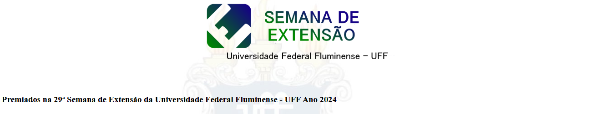
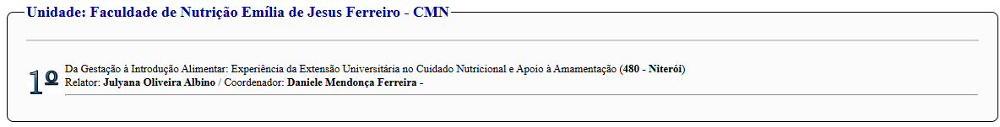
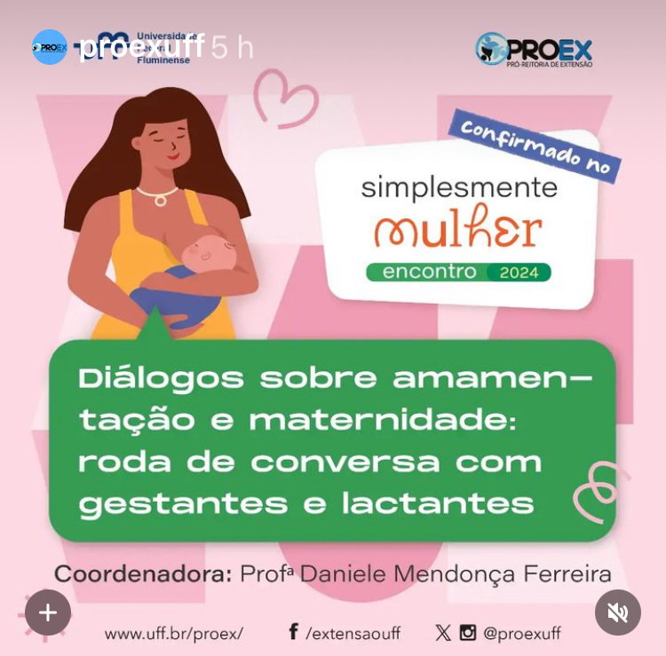
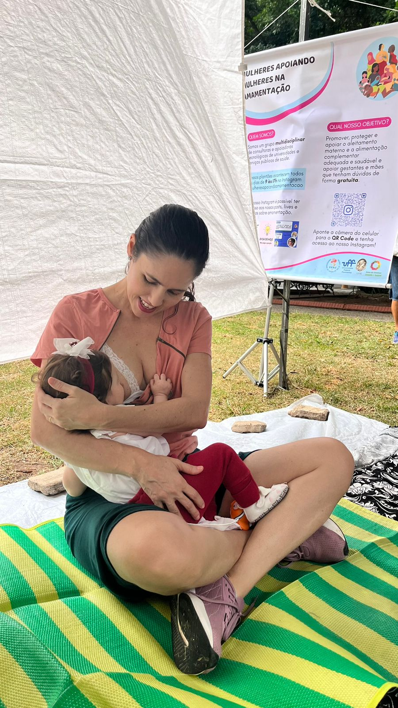
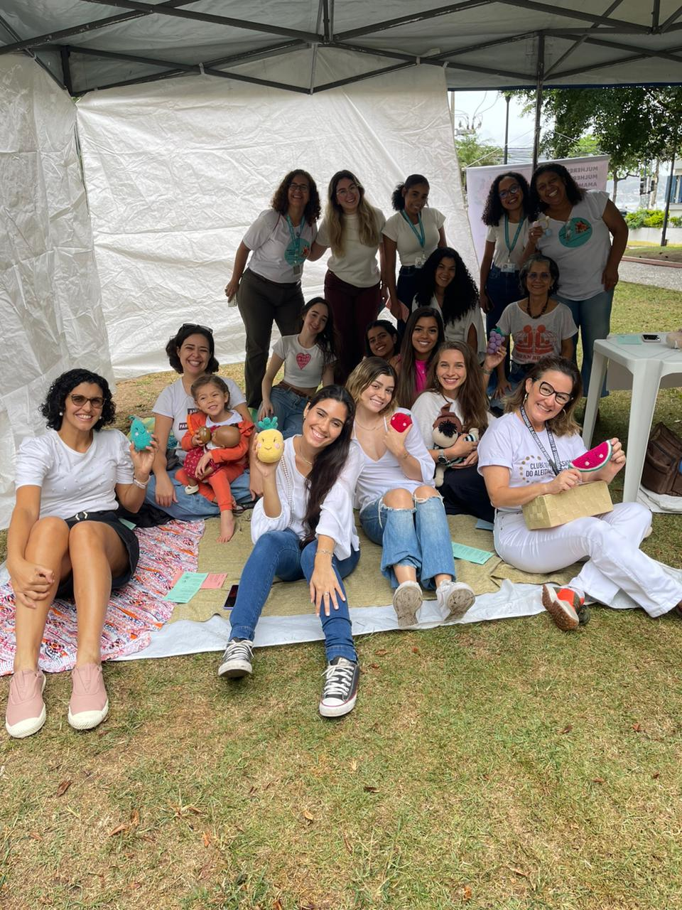

```{r, echo = FALSE}
htmltools::img(src = knitr::image_uri(file.path("imagens/anima.png")), 
               alt = 'anima', 
               style = 'position:absolute; top:50px; right:0px; padding:10px; width:150px;')
```

<br>

## **Extensão**

<br>

Dentro da perspectiva das ações de extensão, a proposta deste projeto valoriza a interação dialógica por meio da troca de saberes entre o conhecimento científico e popular a partir da escuta qualificada das questões relacionadas à saúde da mãe e do bebê e da proposição de ações promotoras da alimentação saudável a partir da realidade econômica, social e cultural das famílias atendidas, possibilitando assim, um impacto social baseado nos interesses e necessidades da população.

<br>

Paralelamente, de modo a adquirir maior efetividade, as ações estão vinculadas ao processo de formação dos alunos de graduação em nutrição e de geração de conhecimento, por meio do desenvolvimento de pesquisas no âmbito da graduação e pós-graduação. Tal envolvimento visa possibilitar um maior impacto na formação dos estudantes pela ampliação da visão teórica que adquirem em sala de aula, a partir do contato direto com as questões sociais apresentadas pelas famílias, reafirmando também, o compromisso ético e solidário da Universidade Pública.

<br>

**ATIVIDADES PROPOSTAS**

<br>

**1.	Atendimento Nutricional Personalizado**

Realizar consultas nutricionais individualizadas com gestantes e lactantes, considerando suas necessidades específicas, condições de saúde e contexto socioeconômico.

<br>

**2.	Educação Nutricional e Saúde Integrativa**

Desenvolver oficinas educativas sobre alimentação saudável, amamentação e introdução alimentar, utilizando materiais lúdicos.

<br>

**3.	Formação e Capacitação de Estudantes**

Envolver alunos da graduação e pós-graduação em Nutrição em atividades práticas e pesquisas aplicadas, promovendo uma formação interdisciplinar e humanizada.

<br>

**4.	Produção de Conhecimento Científico**

Desenvolver estudos acadêmicos relacionados à nutrição materno-infantil, com foco nos impactos da extensão universitária na saúde da comunidade e formação dos estudantes.

<br>

**5.	Monitoramento e Avaliação das Ações**

Criar um sistema de acompanhamento contínuo para avaliar os resultados e impactos do projeto, tanto na comunidade atendida quanto na formação dos estudantes.

<br>

### Semana de Extensão da UFF

<br>

A Semana de Extensão da UFF é um evento anual que reúne projetos de extensão universitária de diversas áreas do conhecimento, promovendo a troca de experiências e a divulgação das ações desenvolvidas pela universidade em parceria com a comunidade. O projeto ANIMA participa ativamente desse evento, apresentando seus resultados e contribuições para a saúde materno-infantil e a formação acadêmica dos estudantes.

<br>

**29<sup>a </sup> SEMEXT**

<br>

Em 2024, o ANIMA recebeu o prêmio de destaque pela Faculdade de Nutrição, em reconhecimento ao seu impacto social e acadêmico, destacando-se como uma referência em extensão universitária na área da saúde.

<br>

<center>


<br>


</center>

<br>

**Evento Simplemente Mulher**

Nos anos de 2023 e 2024, o ANIMA participou do evento Simplesmente Mulher em comemoração ao mês da mulher. O encontro promove uma reflexão inclusiva e abrangente sobre temas importantes, como saúde, bem-estar e qualidade de vida das mulheres, bem como a cidadania feminina e a equidade de gênero.

<br>

<center>



<br>



<br>



</center>

<br>

**Amamenta PNAE**

<br>

No dia 30 de outubro de 2024, a Faculdade de Nutrição da UFF sediou o curso Amamenta PNAE, uma atividade promovida pelo CECANE UFF e ANIMA, voltada para as nutricionistas do Programa Nacional de Alimentação Escolar (PNAE).

O evento reuniu profissionais de diversos municípios do Rio de Janeiro: Niterói, Silva Jardim, Armação dos Búzios, Volta Redonda, Duque de Caxias, Engenheiro Paulo de Frontein, Petrópolis, Paraíba do Sul, Cantagalo e Maricá.

O curso envolveu debates sobre a Nota Técnica do FNDE que orienta a prática de amamentação nas creches, as estratégias de apoio à amamentação no ambiente escolar e apresentou experiências da implementação da amamentação nas creches nos municípios de Petrópolis e São Paulo, que foi fundamental para estimular as nutricionistas a elaborarem um planejamento estratégico para promover a amamentação nas escolas de seus municípios.

<br>

<center>

<iframe src="https://drive.google.com/file/d/1X99bCK2my167l6sLbtxs6fTBkpQf5cfL/preview" width="100%" allow="autoplay"></iframe>

</center>


