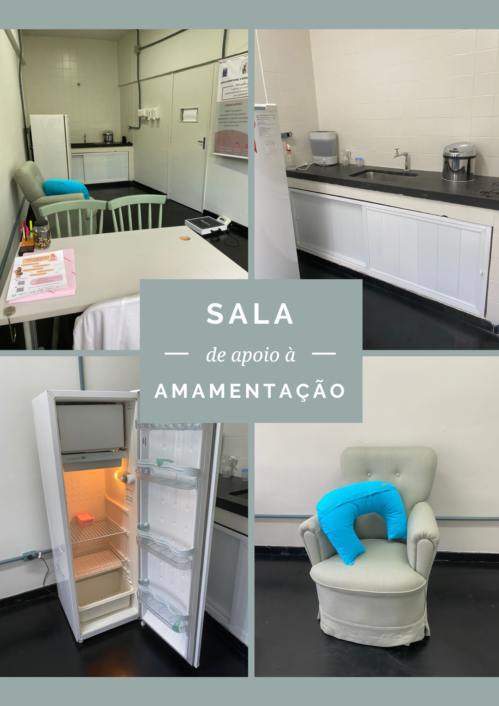
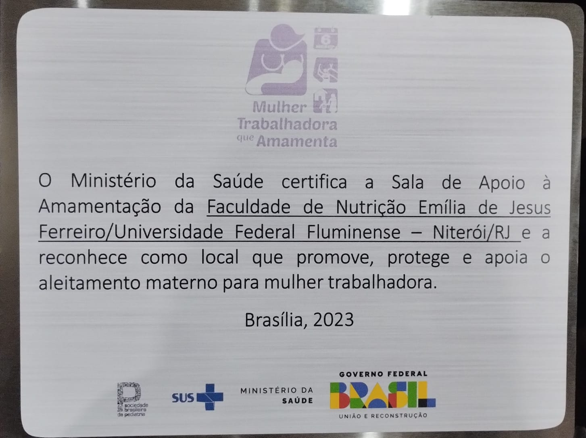

```{r, echo = FALSE}
htmltools::img(src = knitr::image_uri(file.path("imagens/anima.png")), 
               alt = 'anima', 
               style = 'position:absolute; top:50px; right:0px; padding:10px; width:150px;')
```

<br>

## **Sala de Apoio à Amamentação**

<br>

<center>



</center>

<br>
    
A Sala de Apoio à Amamentação da Faculdade de Nutrição da UFF visa apoiar e promover a amamentação de mães estudantes e trabalhadoras que estejam acompanhadas de seus filhos no retorno das suas atividades, ou oferecer suporte adequado para o esvaziamento das mamas e armazenamento do leite materno de forma apropriada.

<br>
  
Idealizada a partir de uma demanda das alunas lactantes do curso de Nutrição, que, sem um espaço para extração do leite materno (LM), a faziam no banheiro da faculdade. Por ser um local insalubre, as alunas descartavam o leite na pia e não podiam aproveitar esse alimento para ser ofertado aos seus filhos. A partir do projeto de extensão ANIMA, em 2022 foi solicitado um espaço com pia, junto ao Colegiado de Unidade da Faculdade de Nutrição, para construir a sala de apoio à amamentação. 

<br>

Com a verba destinada ao projeto, obtida em edital de auxílio financeiro lançado pela Pró-reitoria de Extensão, a sala foi mobiliada como uma poltrona para amamentação e/ou extração do LM e um freezer para armazenamento do leite. Os potes para armazenamento do LM foram obtidos por meio de uma campanha de arrecadação realizada na faculdade. 

<br>

Na sala também ocorrem atendimentos de consultoria em amamentação e apoio às lactantes e seus bebês e crianças. 

<br> 

Em 2023, a sala recebeu uma certificação do Ministério da Saúde de reconhecimento como um local que promove, protege e apoia o aleitamento materno para mulheres trabalhadoras.

<br>

<center>



<br>
    

   
</center>

<br>

<center>
Para reservar horários na Sala de Apoio à Amamentação, preencha o cadastro de interesse no link abaixo:
</center>

<br>

<center>
<button type="button" class="btn btn-primary">[Cadastro de interesse](https://forms.gle/zT6i9ZooafMAN4xp6)</button>
</center>


